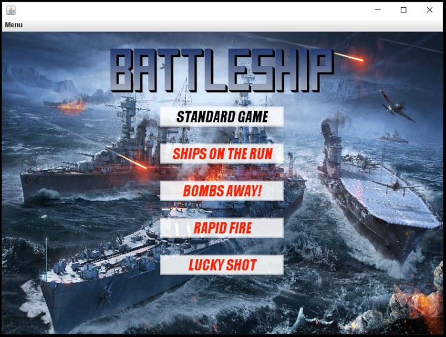
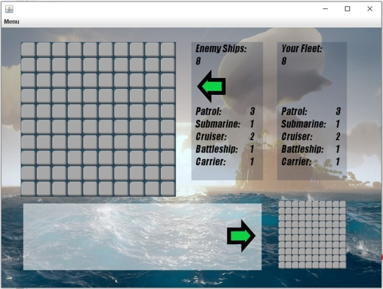
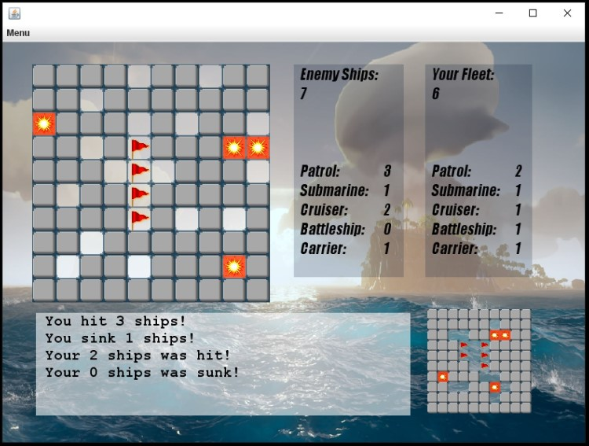
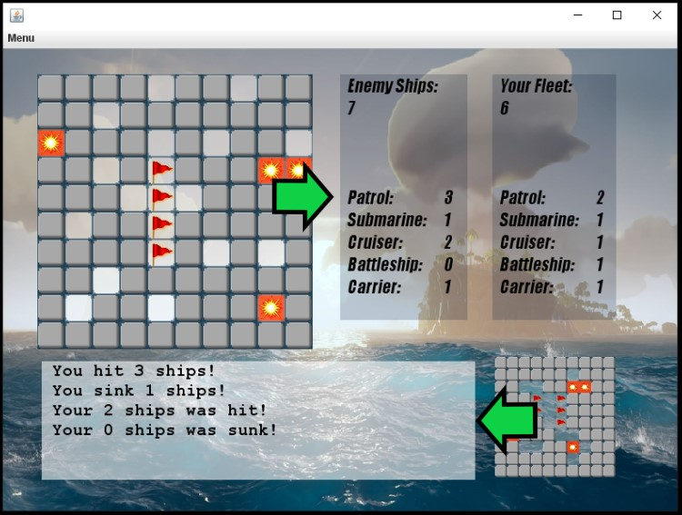
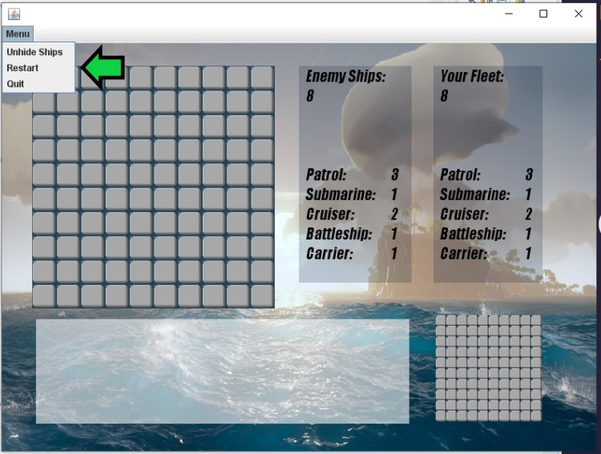
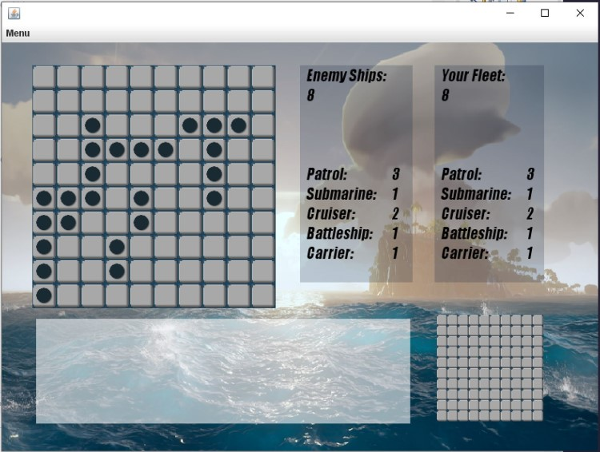
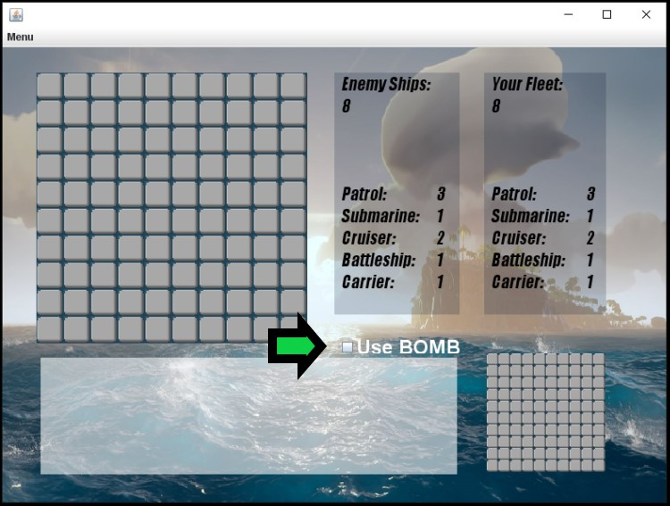

### final-project-summer-2019-team-k

# Battleship Game

## 1. Team Members:
- Hanzhao Yu
- Holland Delany
- Jorge Corrales

## 2. How to run it
Before running the code you are required to copy the file located in this folder:

- final-project-summer-2019-team-k\src

To your local folder.

Once you have copied the files you can start running the game from the **Main.java** class

If you succesfully installed the game it will show the following window:

## 3. Gaming

### 3.1 Description
In this game you are playing versus the computer in a battleship combat, your objective is to sink the computer's fleet before it sinks yours.

### 3.2 The fleets
The computer will create two random arranges of ships, one is your fleet and the other one the computer or "AI" (Artificial Intelligence) fleet.

Each fleet will have eight ships:

- 3 patrols (two square long)
- 1 submarine (three square long)
- 2 cruiser (three square long)
- 1 battleship (four square long)
- 1 carrier (five square long)

### 3.3 The boards
When playing you will see two boards:

- In the top left corner you will have the computer's board, that is the one you are aiming at.
- In the bottom right corner you will have your board, there is where the computer is aiming at.

### 3.4 The squares
To start playing you have to choose a square where to shot in your opponent's board, the squares can take the following values:

- Light gray square: The position has not received any shot.
- Dark gray square: The position has been selected (Rapid Fire mode)
- Translucid square: The position received a shot but it was empty.
- Explosion square: The position represents a section of a ship that has received a shot but the ships is still floating.
- Red flagged square: The position represents a section of a ship that has been sunk

### 3.5 Tracking the game

You can track the progress of the game in the ships inventory (top right corner) that shows the total number or ships floating and the same data split by ship type.

The second way to track the game is in bottom left console that will narrate the changes in the status of the squares.

### 3.6 Menu

When clicking on **Menu** the player will be prompted with three options:

- Unhide Ships: this will reveal all the opponent's ships. Cannot be undone.

- Restart: this will take the user back to the main screen to choose the gaming mode.
- Quit: this will close the entire application.

## 4. Gaming Modes

The game has five different modes that are explained below.

### 4.1 Standard Game

This is the classic game mode, each player has one shot per turn (the user will make the first one).

### 4.2 Ships on the Run

In this mode each player has one shot per turn, but the ships will move and recover from the shots if they are not hit after a certain number of not being hit.

### 4.3 Bombs Away!

The user has an specific quantity of bombs (three) that can be used during the game, if a ship is hit by a bomb it will inmediately be sunk.

### 4.4 Rapid Fire

Each turn you will be given a quantity of shots equal to the number of ships that the opponent has remaining. The player will make the shots without knowing what impact they had until the end of the turn.

### 4.5 Lucky Shot

Don't worry if you missed several shots in a row, later the computer will help you to find a target!
